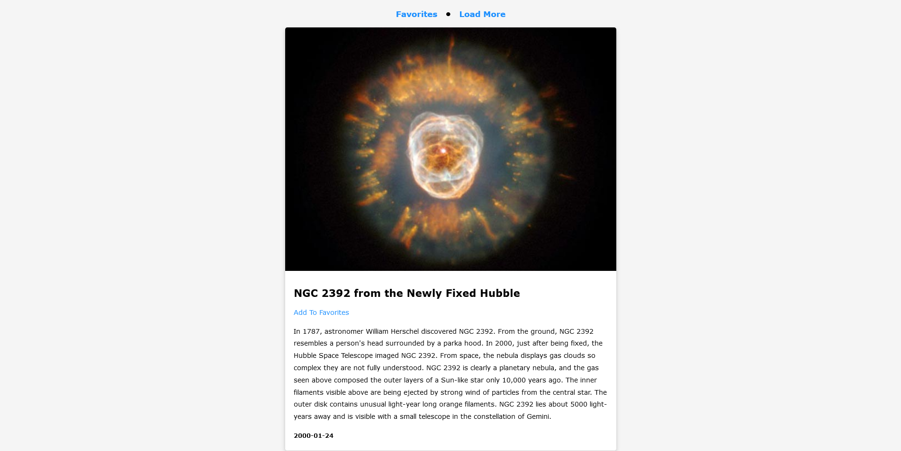

# NASA APOD (Astronomy Picture of the Day)

The NASA APOD project is an interactive and visually appealing web application that retrieves and displays the Astronomy Picture of the Day using NASA's API. Users can browse through stunning images and save their favorites, which are stored locally for future reference.

This project was developed as part of the course "JavaScript Web Projects: 20 Projects to Build Your Portfolio" by Zero To Mastery.

## Table of contents

- [NASA APOD (Astronomy Picture of the Day)](#nasa-apod-astronomy-picture-of-the-day)
  - [Table of contents](#table-of-contents)
  - [Overview](#overview)
    - [Screenshot](#screenshot)
    - [Links](#links)
    - [Built with](#built-with)
    - [What I learned](#what-i-learned)
    - [Useful resources](#useful-resources)
  - [Author](#author)
  - [Acknowledgments](#acknowledgments)

## Overview

This project integrates NASA's APOD API to fetch and display daily astronomy images and their details. The app offers an intuitive and engaging experience, allowing users to:
- Browse and view high-quality astronomy images with titles, descriptions, and credits.
- Add images to a favorites list, stored locally using localStorage.
- Navigate dynamically between the "Recent" and "Favorites" views.
- Experience smooth loading animations and a responsive design optimized for various devices.

### Screenshot



### Links

- Live Site URL: [DT Code](https://nasa-apod.dtcode.se/)

### Built with

- HTML5: Semantic structure for accessibility.
- CSS3:
  - Responsive styling using media queries.
  - Modern UI design with hover effects and animations.
- JavaScript (ES6+):
  - Fetch API for asynchronous data retrieval.
  - DOM manipulation to dynamically generate and display content.
  - Local storage to persist favorite images.

### What I learned

This project helped me improve my skills in:
- API Integration: Fetching and handling data from NASA's API.
- Local Storage: Persisting user data for a seamless experience across sessions.
- DOM Manipulation: Dynamically generating and updating content based on user actions and API responses.
- Responsive Design: Ensuring the app looks great on all devices.

The following code snippet demonstrates how the app dynamically creates DOM elements for each image:

```js
function createDOMNodes(page) {
    const currentArray = page === 'results' ? resultsArray : Object.values(favorites);
    currentArray.forEach((result) => {
        const card = document.createElement('div');
        card.classList.add('card');

        const link = document.createElement('a');
        link.href = result.hdurl;
        link.title = 'View Full Image';
        link.target = '_blank';

        const image = document.createElement('img');
        image.src = result.url;
        image.alt = 'NASA Picture of the Day';
        image.loading = 'lazy';
        image.classList.add('card-img-top');

        const cardBody = document.createElement('div');
        cardBody.classList.add('card-body');

        const cardTitle = document.createElement('h5');
        cardTitle.classList.add('card-title');
        cardTitle.textContent = result.title;

        const saveText = document.createElement('p');
        saveText.classList.add('clickable');
        saveText.textContent = page === 'results' ? 'Add To Favorites' : 'Remove Favorite';
        saveText.setAttribute('onclick', `saveFavorite('${result.url}')`);

        const cardText = document.createElement('p');
        cardText.textContent = result.explanation;

        const footer = document.createElement('small');
        footer.classList.add('text-muted');
        footer.textContent = result.date;

        cardBody.append(cardTitle, saveText, cardText, footer);
        card.append(link, image, cardBody);
        imagesContainer.appendChild(card);
    });
}
```

The createDOMNodes function is called during the DOM update process to dynamically create and display image cards based on the data retrieved from the NASA API.

### Useful resources

- [NASA APOD API Documentation](https://api.nasa.gov/) - This resource explains how to use NASA's API to fetch data, including parameters and response details.
- [MDN Web Docs: Fetch API](https://developer.mozilla.org/en-US/docs/Web/API/Fetch_API) - A comprehensive guide to understanding and using the Fetch API for retrieving data asynchronously.
- [MDN Web Docs: localStorage](https://developer.mozilla.org/en-US/docs/Web/API/Window/localStorage) - Useful documentation on how to store and retrieve data in the browser using localStorage.

## Author

- GitHub - [@dantvi](https://github.com/dantvi)
- LinkedIn - [@danieltving](https://www.linkedin.com/in/danieltving/)

## Acknowledgments

Special thanks to Zero To Mastery for the inspiration and structured guidance. Also, thanks to NASA for making these incredible images accessible via their API.
